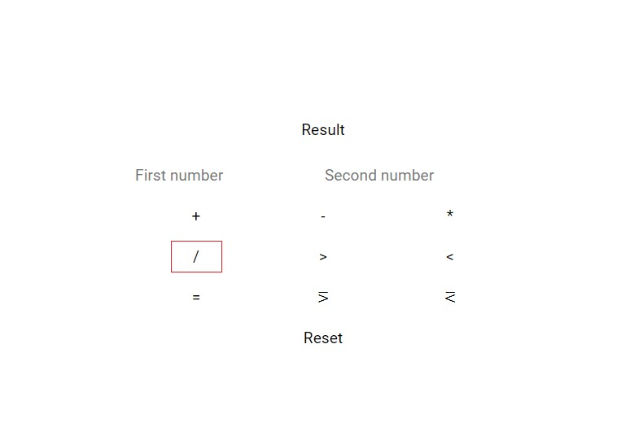

# Simple calculator

Посилання на сайт: https://taraskostiv.github.io/ampli-adv-fe-13-calc/ (master branch)

## Інструкція по використанню

### Інтерфейс та його блоки

Це інтерфейс калькулятора
  

Калькулятор поділений на 5 блоків (Блок результату, два блока (поля) введення значень, блок математичних функцій та блок (кнопка) скидання значення на початкові)

1. **Блок результату** - виділений червноним прямокутником та показує результат дій над введиними двома змвнними при виконані певної математичної функції;
2. **Два блоки (поля) введення значень** - підкресленні зеленими лініями та дають можливість вводити як цілі числа (1, 2, 3, 4 тощо), так і не цілі (2.45, 85.86, 98.05 тощо (*проте не цілі числа будуть заукруглюватись до 2 цифри після коми*));
3. **Блок математичних функцій** - виділений синім прямокутником та містить в собі дев'ять різних матемтичних функцій. При виконанні певної функції буде відбуватись математична дія над дво введеними значеннями та виведеня результату в блок результату;
4. **Блок (кнопка) скидання значення на початкові** - підкреслена чорною лінією та при натисканні скидає значення введені в блоки (поля) введення значень на початкові.
    

### Математичні функції

1. **Додавання** - функція, яка додає два введених значення (виділена червоним прямокутником) і позначенна '+'.
    

2. **Віднімання** - функція, яка віднімає два введених значення (виділена червоним прямокутником) і позначенна '-'.
    

3. **Множення** - функція, яка множить два введених значення (виділена червоним прямокутником) і позначенна '*'.
    

4. **Ділення** - функція, яка ділить два введених значення (виділена червоним прямокутником) і позначенна '/'.
    

5. **Більше** - функція, яка порівнює перше введене значення з другим і визначає чи більше перше значення за друге.
    

6. **Менше** - функція, яка порівнює перше введене значення з другим і визначає чи менше перше значення за друге.
    

7. **Дорівнює** -  функція, яка порівнює перше введене значення з другим і визначає чи рівні значення між собою.
    

8. **Більше дорівнює** - функція, яка порівнює перше введене значення з другим і визначає чи більше перше значення за друге, чи рівні значення між собою.
	
   
9. **Менше дорівнює** - функція, яка порівнює перше введене значення з другим і визначає чи менше перше значення за друге, чи рівні значення між собою.
	
	
## Про розробника

Мене звати Тарас, мені 15 років. Я начаюсь FrontEnd на курсах Ampli впродовж майже одного року. Я навчився та закріпив на практиці HTML (симантику, BEM), CSS (SCSS, SASS, робота з картинками та заднім фоном), JS (основи JS, Jquery та основи ReactJS). Я маю багато ентузіазму до вдосконалення тому залишайте свій фідбек за цією поштою 007kostiv@gmail.com.